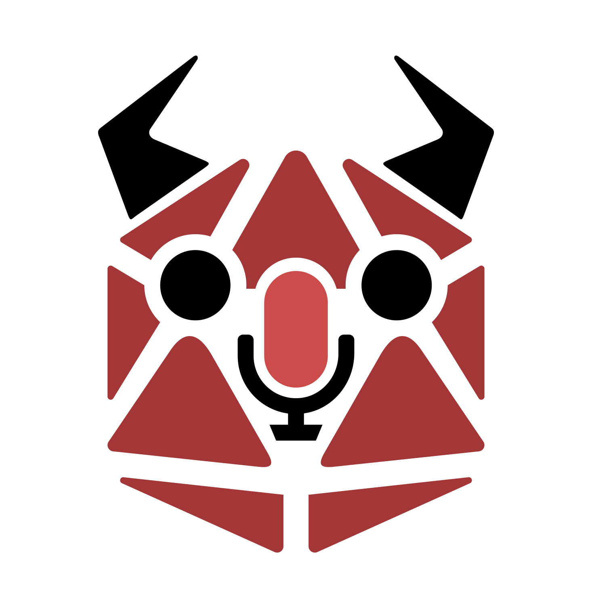

=  Minotaure
:toc:
:toc-title: Table des matières

[link=./README-EN.adoc]
image::https://img.shields.io/badge/lang-en-red.svg[en]

Minotaure est un outil vous aidant à animer une aventure pour plusieurs dizaines ou centaines de personnes.
Ses mécanismes sont en partie empruntées au jeu de rôle classique mais appliquées à une population plus large. Minotaure s'inspire du fonctionnement d'un outil plus ancien créé par https://www.fibretigre.com/[FibreTigre] sous le nom ATRPG.

L'application est à utiliser en complément d'une application de streaming vidéo et d'un système de messagerie instantané (Twitch, Discord, etc.)
Chaque personne rejoignant votre partie disposera d'une fiche de personnage minimaliste.

Vous pourrez ranger ces personnages dans des catégories (**tags**) différentes (genre, espèce, classe, couleur, faction, etc.). Cela pourra influencer leurs **caractéristiques** (force, agilité, etc.) et leurs **jauges** (vie, volonté, etc.).

Vous allez proposer des choix aux participants grâce aux **sondages**.

Vous pourrez aussi leur faire passer des **épreuves** (similaire à des jets de dés).

Les épreuves et les sondages pourront avoir, en plus de leurs conséquences sur l'aventure, des **conséquences** sur les fiches des personnages (ajout / suppression de tags, modification de caractéristiques et/ou de jauges).

Vous voulez en savoir plus ? Vous cherchez des exemples de situation de parties ? Tout est sur le https://github.com/uurshin/minotaure/wiki[wiki].

== Comment installer Minotaure ?

=== Option 1 - Utiliser le site officiel

La dernière version de Minotaure tourne en permanence à cette adresse : https://uurshin.github.io/minotaure[uurshin.github.io/minotaure]

=== Option 2 - Installer votre propre site

https://github.com/uurshin/minotaure/releases/latest/download/index.html[Téléchargez la dernière version]

Hébergez le fichier index.html sur un serveur puis naviguez vers l'adresse de ce fichier. Très pratique, vous n'avez ensuite qu'à partager aux participants le lien fourni lors du démarrage de partie.
Des solutions comme surge.sh ou les pages github peuvent être utilisées pour héberger votre site gratuitement.

=== Où sont conservés les parties et personnages ?

Si vous créez une partie, vos données (y compris les fiches de personnages créées par les participants) sont conservées dans **votre navigateur** .
Si vous avez rejoint une partie, l'identifiant de votre personnage est conservé dans le stockage local de **votre navigateur**.
Lors que vous rejoignez une partie dans laquelle vous avez déjà un personnage, la partie vous réattribuera le même personnage si vous la rejoignez avec **le même navigateur et le même appareil (téléphone, ordinateur, etc.) **.
Vous pouvez exporter vos personnages et vos parties pour jouer à partir d'autres appareils et/ou navigateurs.

== Comment utiliser Minotaure ?

=== Créer une partie

1. Dans le menu principal, cliquez sur **créer une partie**.
2. Après avoir choisi le nom, un identifiant unique vous sera attribué (il servira à rejoindre votre partie pour vos participants). Cliquez sur **Lancer la partie**
3. Une fois dans la partie, cliquez sur **Inviter à rejoindre**. Votre presse-papiers contiendra alors le lien à partager à vos participants.
4. Cliquez sur **Démarrer** pour que les participants puissent créer leurs personnages.
5. Vous pouvez modifier les paramètres de vos parties à tout moment, qu'elle soit démarrée ou non. Si vous ne savez pas utiliser Minotaure, vous pouvez consulter le wiki. Vous pouvez également cliquer sur **Aide** dans l'écran de votre partie pour lancer un didacticiel.

=== Continuer une partie

Si vous avez créé une partie, vous pouvez la continuer à l'état où vous l'avez quittée.

1. Dans le menu principal, cliquez sur **Gérer vos parties**.
2. Choisissez une partie dans la liste, et cliquez sur **Continuer**
3. Pour serez alors à la première étape de la création de partie.

=== Rejoindre une partie

1. Si un lien pour rejoindre vous a été communiqué, cliquez dessus. Si un identifiant de partie vous a été communiqué au lien d'un lien, cliquez sur **rejoindre une partie** dans le menu principal puis entrez l'identifiant fourni et validez.
2. Si la partie a déjà démarré, vous pourrez créer un personnage. Sinon, vous serez en attente du démarrage.

Si vous accédez à une partie où vous possédez déjà un personnage, il vous sera automatiquement attribué, mais il faut que vous utilisiez le même appareil et le même navigateur que lorsque vous avez accédé à la partie la dernière fois. Pour utiliser un autre appareil ou navigateur (par exemple pour rejoindre sur votre téléphone au lieu de votre ordinateur), consultez le wiki pour en savoir plus sur l'import/export de personnage. Pas d'inquiétude, c'est très simple !

=== Où trouver des parties ?

[link=https://discord.gg/zQBTAXE8]
image::https://discordapp.com/api/guilds/828320530444451880/widget.png?style=banner2[Discord Banner 1]

== Contribuer au développement

Minotaure est un logiciel open source. Nous vous invitons à contribuer à ses futures versions à travers notamment du code, de la traduction, des tests et de la documentation.
N'hésitez pas à nous avertir de bugs ou à nous proposer des évolutions en ouvrant des https://github.com/uurshin/minotaure/issues[tickets].

=== Installation des sources

Pour construire le projet, clonez le puis lancez les commandes suivantes (la commande npm doit être disponible) :
 `npm ci`

Ensuite, vous pouvez créer une build pour, au choix :

- un seul fichier .html auto-suffisant `npm run build --` (le fichier index.html pourra être trouvé dans le dossier /dist/single)
- une arborescence de fichiers avec `npm run build -- --mode=multiple` (le fichier index.html pourra être trouvé dans le dossier /dist/multiple)

=== Icônes de l'application

Les icônes utilisés dans ce projet sont injectés dans une webfont produite grâce à : https://icomoon.io/#faq[IcoMoon]
Si un de vos développements nécessite un nouvel icône, importez le fichier icomoon_minotaure.json, effectuez vos modifications puis exportez le projet et la police avant de soumettre vos modifications sur le dépôt. Assurez-vous de ne proposer que des icônes libres de droit.
